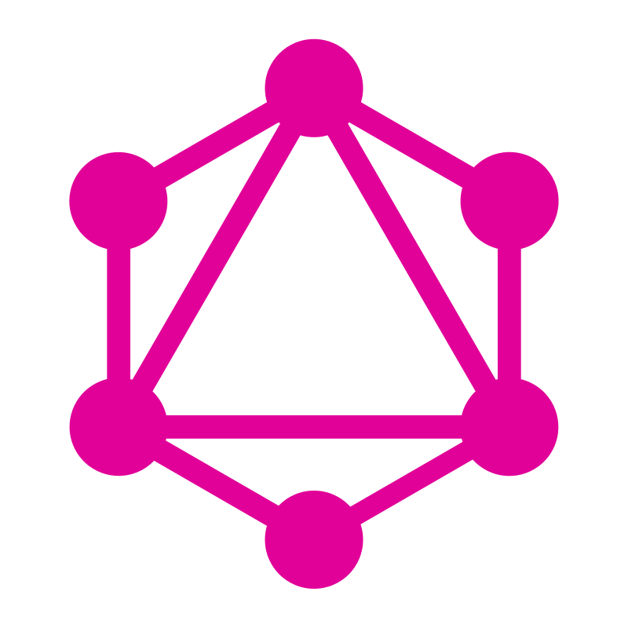
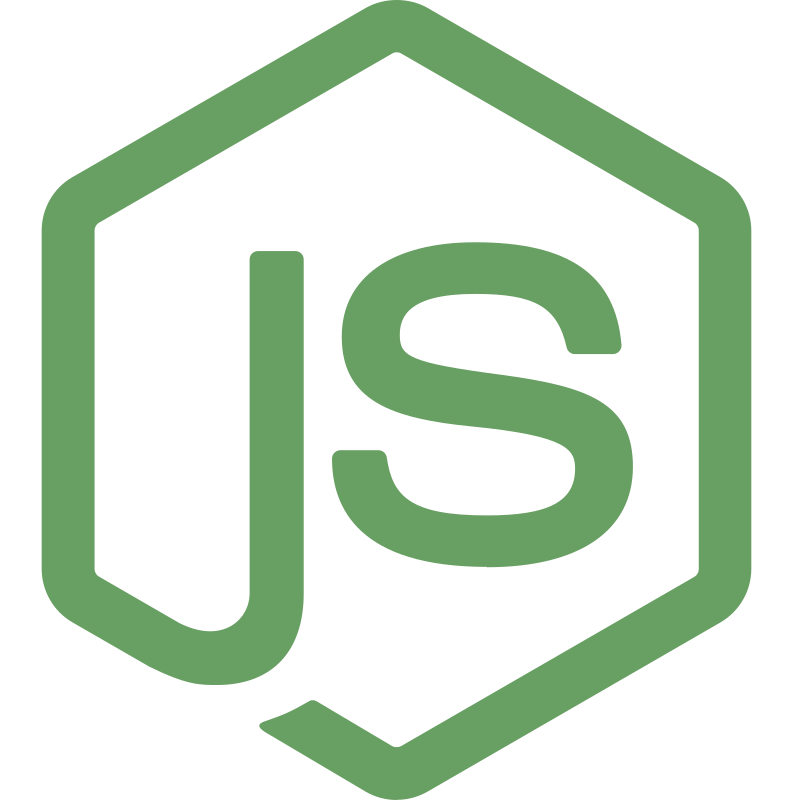
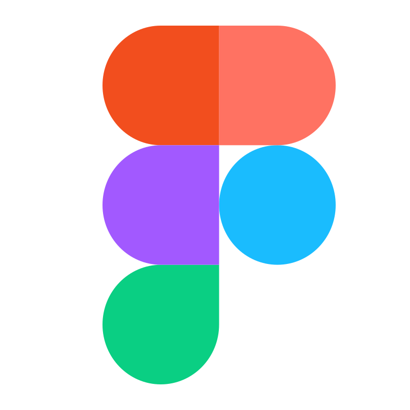

## Hi! I'm Lakshmikanta Patra 👋 🌱

As a passionate Javascript  Full Stack Developer, I am dedicated to creating better ✨ user experiences through 🤓 efficient, 🦋 responsive, 🔒 secure and  🦎 dynamic web applications. My Primary tech stack is ✅ NodeJs and ✅ PHP but I am comfortable learning new technology 😎 and make web security😈 and expericen ✨ better for end user.

- 📝 I can code with -
  
  
  
  
  

- 🧰 Tools I'm comfortable to use -
  
  
  
  
  
  

- 🗃️ Operating System -
  
  

---

👉 Possessing a keen eye for 🔭 detail and a commitment to delivering high-quality code, I thrive in 🤝 collaborative environments where I can contribute my technical prowess and creativity to drive 🎯 impactful solutions.

---

---

